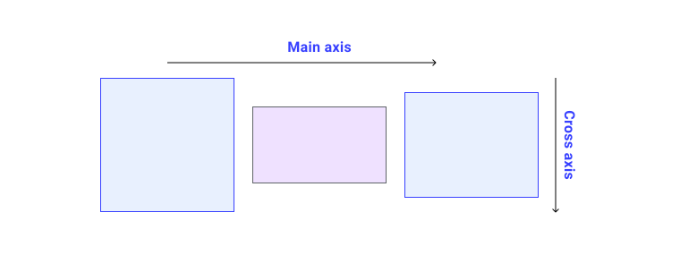

# FLEXBOX LAYOUT
----------------
The Flexible Box Layout, makes it easier to design flexible responsive layout structure.

## FLEX CONTAINER (PARENT ELEMENT)
----------------------------------
The flex container is the Parent Element.The flex container becomes flexible by setting the display property of the parent to flex:

The parent container with two direct children

```html
<div class="parent-container">
  <div>A</div>
  <div>B</div>
</div>
```

### PARENT PROPERTIES
---------------------

The flex container properties are as follows:

```css
The parent container 
.parent-container {
  display: flex;
}
```
The flex-direction property defines in which direction the container wants to stack the flex items.

```css
flex-direction: row | column | row-revese | column-revese
```
The flex-wrap property specifies whether the flex items should wrap or not.

```css
flex-wrap: no-wrap | wrap | wrap-reverse
```
The flex-flow property is a shorthand property for setting both the flex-direction and flex-wrap properties.

```css
flex-flow: flex-direction | flex-wrap
```

The justify-content property is used to align the flex items.

It distribute spaces on the main axis.


```css
justify-content : flex-start | flex-end | center |space-between | space-around | space-evenly
```

The align-items property is used to align the flex items.

It distribute spaces on the cross axis.



```css
align-items: baseline | center | stretch | flex-end | flex-start
```

The align-content property is used to align the flex lines.

```css
align-content:flex-start | flex-end | center |space-between | space-around | stretch;
```

### FLEX ITEMS(CHILD ELEMENTS)
------------------------------
The direct child elements of a flex container automatically becomes flexible (flex) items.
The flex item properties are:
- order
- flex-grow
- flex-shrink
- flex-basis
- flex
- align-self

#### The order Property
------------------------
The order property specifies the order of the flex items.
The first flex item in the code does not have to appear as the first item in the layout.
The order value must be a number, default value is 0.

```html
<div class="flex-container">
  <div style="order: 3">1</div>
  <div style="order: 2">2</div>
  <div style="order: 4">3</div>
  <div style="order: 1">4</div>
</div>
```

#### The flex-grow Property
---------------------------
The flex-grow property specifies how much a flex item will grow relative to the rest of the flex items.
The value must be a number, default value is 0.

```html
<div class="flex-container">
  <div style="flex-grow: 1">1</div>
  <div style="flex-grow: 1">2</div>
  <div style="flex-grow: 8">3</div>
</div>
```
#### The flex-shrink Property
------------------------------
The flex-shrink property specifies how much a flex item will shrink relative to the rest of the flex items.
The value must be a number, default value is 1.

```html
<div class="flex-container">
  <div>1</div>
  <div>2</div>
  <div style="flex-shrink: 0">3</div>
  <div>4</div>
  <div>5</div>
  <div>6</div>
  <div>7</div>
  <div>8</div>
  <div>9</div>
  <div>10</div>
</div>
```

#### The flex-basis Property
----------------------------
The flex-basis property specifies the initial length of a flex item.
Example
Set the initial length of the third flex item to 200 pixels:

```html
<div class="flex-container">
  <div>1</div>
  <div>2</div>
  <div style="flex-basis: 200px">3</div>
  <div>4</div>
</div>
```

#### The flex Property
----------------------
The flex property is a shorthand property for the flex-grow, flex-shrink, and flex-basis properties.
Example
Make the third flex item not growable (0), not shrinkable (0), and with an initial length of 200 pixels:

```html
<div class="flex-container">
  <div>1</div>
  <div>2</div>
  <div style="flex: 0 0 200px">3</div>
  <div>4</div>
</div>
```

#### The align-self Property
----------------------------
The align-self property specifies the alignment for the selected item inside the flexible container.
The align-self property overrides the default alignment set by the container's align-items property.
In these examples we use a 200 pixels high container, to better demonstrate the align-self property:

Example
Align the third flex item in the middle of the container:

```html
<div class="flex-container">
  <div>1</div>
  <div>2</div>
  <div style="align-self: center">3</div>
  <div>4</div>
</div>
```

Example
Align the second flex item at the top of the container, and the third flex item at the bottom of the container:

```html
<div class="flex-container">
  <div>1</div>
  <div style="align-self: flex-start">2</div>
  <div style="align-self: flex-end">3</div>
  <div>4</div>
</div>
```